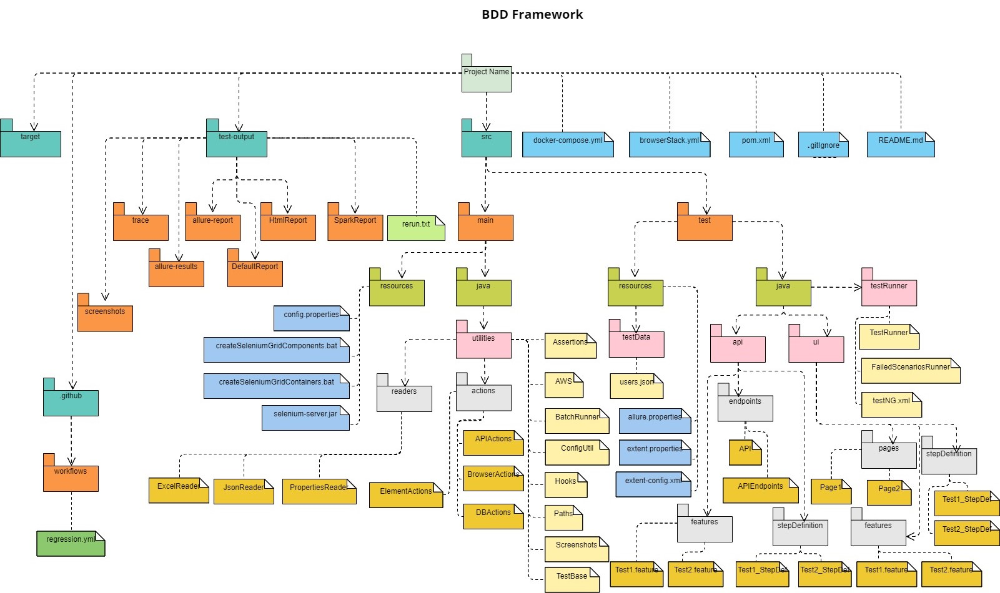

# BDD-FE

`How To :`

1- Specify files and tags that should be run from runner class under Test Runner package 

2- Configure TestNG.xml file for browser to run the file as testNG file

3- Configure pom.xml file for test environment to run the file as testNG file

4- Every scenario should have its id in its name

5- Every feature file should have tag with its US id

6- Every feature should has 3 files (feature file - step def. - page)

7- Pages should hold locators, strings, actions and assertions and inherits from ElementActions

8- Feature files should have business scenarios

9- Step def should has technical steps and inherits from pages

10- Assertions uses assertion class

11- We locate element using method in element actions class (getElement())

12- Variables and methods should start with small letters

13- Write locators, tickets, scenario steps and step def methods in the order of the page under test

14- Step def class should end with _StepDef

15- Do not assert on existence of a certain element if we will assert on its text

16- Do not write any methods if you will not use it

17- Do not make more than 2 Then in the scenario except view page scenario

18- For every api we create feature file with its name, endpoint class, extraction class and step def

19- You can run the project by right click on test runner or testNG.xml and choose run

20- Endpoint class, extraction class are under pages package

21- FE feature files are divided into 4 groups (Login - Dashboard - Common - Create)

22- You can adjust your running configurations from main/resources/config.properties and test/testRunner/testNG.xml files

23- Result report is added under test-output/SparkReport

24- You can use the below mvn command to run on pipeline and replace the default tags with the tags inside the command

    mvn test -Dcucumber.filter.tags="@sanity and @FERegression"

25- Below is a simple package flow that describe the project structure

